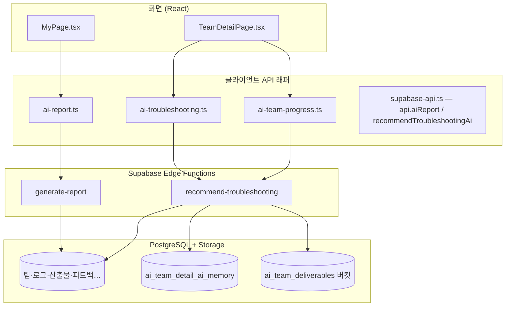

# AI 기능 — 인간용 완전 가이드

> **최종 갱신:** 2026-05-26  
> **관련:** [30_edge_ai_report.md](./30_edge_ai_report.md) (Secret·배포) · [37_verify_ai_report.md](./37_verify_ai_report.md) (리포트 집계 확인) · 기술: `doc/for_agent/10_ai_system.md`

코딩을 몰라도 괜찮습니다. CampusConnect의 **AI 기능이 무엇인지**, **어디에 보이는지**, **코드가 어떻게 연결되는지**를 한 문서에 정리했습니다.

---

## 한눈에 보기 — AI 기능 3가지

| # | 화면에서 보이는 이름 | 누가 쓰나 | 하는 일 |
|---|---------------------|-----------|---------|
| 1 | **마이페이지 리포트** (PAGE 1~3) | 학생 | 팀 활동·트러블슈팅·산출물 등을 모아 **성장 리포트 문단**을 AI가 작성 |
| 2 | **트러블슈팅 AI 추천** | 학생·교수 | 팀 워크스페이스에서 **다음에 조사할 문제**를 AI가 제안 |
| 3 | **AI 통합 진행상황 요약** | 학생·교수 | 산출물 ZIP·소스·로그를 읽고 **프로젝트 상태·보완점·다음 할 일**을 요약 |

세 기능 모두 **같은 Gemini API 키**(`GEMINI_API_KEY`)를 Supabase Edge Secret으로 씁니다. 브라우저에는 키가 없습니다.

---

## 왜 서버(Edge)를 거치나?

API 키는 비밀번호와 같습니다. React 코드(`VITE_*`)에 넣으면 Git·브라우저에 노출됩니다.

```
[브라우저]  →  Supabase Edge Function  →  Google Gemini API
              (Secret에 GEMINI_API_KEY)
```

---

## 전체 구조 (코드 지도)



### 파일 위치 (개발자·AI가 찾을 때)

| 역할 | 경로 |
|------|------|
| 마이페이지 리포트 집계·Edge 호출 | `src/app/api/ai-report.ts` |
| 트러블슈팅 추천 Edge 호출 | `src/app/api/ai-troubleshooting.ts` |
| 진행상황 요약 Edge 호출 | `src/app/api/ai-team-progress.ts` |
| DB 폴백(진행 요약) | `src/app/api/supabase-api.ts` → `buildTeamProgressInsight()` |
| 타입 정의 | `src/app/types/ai-report.ts`, `ai-troubleshooting.ts`, `ai-team-progress.ts` |
| Edge: 리포트 | `supabase/functions/generate-report/index.ts` |
| Edge: 추천·진행요약 | `supabase/functions/recommend-troubleshooting/index.ts` |
| AI 로딩 UI | `src/app/components/AiGeneratingIndicator.tsx` |
| 무지개 shimmer CSS | `src/styles/material3.css` (`cc-gemini-*`) |
| 팀 AI 기억 테이블 | `supabase/migrations/20260526232000_ai_team_detail_ai_memory.sql` |

---

## 기능 1 — 마이페이지 AI 리포트

### 사용자 경험

1. **학생**이 로그인 후 **마이페이지** 진입
2. 잠시 **무지개 shimmer** 로딩
3. PAGE 1~3 박스에 요약·기술·역할·성장 문단이 채워짐
4. **A4 인쇄 / PDF** 버튼으로 인쇄

**교수·관리자** 계정은 학생용 리포트·AI 호출이 숨겨집니다.

### 데이터 흐름 (단계별)

```
1. MyPage.tsx
      ↓ useEffect
2. api.aiReport.gatherContext(userId)     ← DB만 (Supabase 직접 조회)
      · 참여 팀, 트러블슈팅, 산출물, 피드백, 회고, 동료평가, 교수 평가
      ↓
3. api.aiReport.generateReport({ userId })  ← Edge generate-report
      ↓
4. buildMyPageReportView(context, edgeResult)  ← DB 숫자 + AI 문단 합침
      ↓
5. 화면 3페이지 + AiReportPrintView (인쇄)
```

### Edge `generate-report`

- **요청:** `{ "userId": "...", "locale": "ko" }`
- **응답 필드:** `summary`, `problems_solved`, `technologies`, `role_description`, `growth_reflection`, `model` 등
- **우선순위:** Gemini → (레거시) OpenAI → **DB 초안** (`model: "draft-db-only"`, HTTP 200)
- **키 없을 때:** 에러가 아니라 DB에서 만든 문장으로 채움

자세한 Secret·배포: [30_edge_ai_report.md](./30_edge_ai_report.md)

---

## 기능 2 — 트러블슈팅 AI 추천

### 사용자 경험

- **팀 상세** 페이지 → 트러블슈팅 섹션 맨 위 **「AI 추천」** 카드
- 팀이 올린 **산출물·ZIP 소스·기억 문서**를 참고해 “지금 조사하면 좋을 문제” 한 줄 제안

### 데이터 흐름

```
TeamDetailPage.tsx
      ↓ teamId 변경 시
api.recommendTroubleshootingAi({ teamId, locale: "ko" })
      ↓
Edge recommend-troubleshooting (intent 기본값: troubleshooting)
      ↓
{ problem, plan, rationale, model }
```

Edge는 `gatherTeamContext()`로 다음을 모읍니다.

- 산출물 게시판 메타
- 트러블슈팅 로그
- 팀 채팅 최근 메시지
- **ZIP/소스 스니펫** (Storage에서 다운로드, JSZip으로 `.ts`/`.tsx` 등 추출)
- `ai_team_detail_ai_memory`에 저장된 **이전 분석 기억**

**최신 산출물 2건**은 분석 이력과 관계없이 항상 ZIP/소스를 다시 읽습니다 (`alwaysSampleLatestFileCount`).

---

## 기능 3 — AI 통합 진행상황 요약

### 사용자 경험

- **팀 상세** 상단 보라색 패널 **「✨ AI 통합 진행상황 요약」**
- 요약 문장 + 강점/보완 + **다음에 할 일** + **아키텍처·구조 주의** + **개선 방향**

### 데이터 흐름

```
TeamDetailPage.tsx
      ↓ deliverables, logs 변경 시
fetchTeamProgressInsightFromEdge(teamId)   ← intent: "progress-insight"
      ↓ 실패 또는 얕은 응답이면
buildTeamProgressInsight() (클라이언트 DB 폴백)
      ↓
normalizeProgressInsightForDisplay()  ← 중복·길이 제한
```

### Edge `progress-insight` 모드 (같은 함수, 다른 intent)

`recommend-troubleshooting` Edge에 `intent: "progress-insight"`를 보냅니다.

| 단계 | 설명 |
|------|------|
| 1 | 팀 DB에서 산출물·로그·채팅 수집 |
| 2 | **아직 분석 안 한 산출물**만 ZIP/소스 추출 (증분) |
| 3 | Gemini로 JSON 요약 생성 |
| 4 | 품질이 낮으면 **휴리스틱** (`heuristic-insight`) — 스택·README·API/UI 등 코드 신호 분석 |
| 5 | 결과를 `ai_team_detail_ai_memory`에 마크다운으로 저장 → 다음 방문 시 “기억” 반영 |

**클라이언트 폴백** (`buildTeamProgressInsight`):

- Edge 미연결·얕은 응답 시 사용
- 산출물 **설명 전문**이 아니라 **제목·부제·짧은 요약(48자)** 만 반영
- 설명란 `🔗 배포 링크:` 도 **데모 URL**로 인식 (별도 링크 산출물 없어도 됨)
- ZIP은 파일명에 `.zip`이 없어도 mime/경로로 인식

---

## 공통: 산출물 ZIP·소스 읽기

Edge `recommend-troubleshooting` 내부:

1. Storage 버킷 `ai_team_deliverables`에서 파일 다운로드
2. ZIP이면 **JSZip**으로 내부 파일 스캔 (`node_modules`, `.git` 제외)
3. `.ts`, `.tsx`, `.js`, `.py`, `package.json`, `README` 등 우선 추출
4. Gemini/휴리스틱에 `source_code_samples`로 전달

프로젝트 **폴더 업로드**는 브라우저에서 ZIP으로 묶은 뒤 올립니다 (`projectSourceZip.ts`).

---

## GEMINI 키가 없을 때 (폴백 정리)

| 기능 | 키 없음 | 키 있음 |
|------|---------|---------|
| 마이페이지 리포트 | DB 초안 문장 (`draft-db-only`) | `gemini-2.5-flash` 등 |
| 트러블슈팅 추천 | DB 메타 초안 (`draft-db-only`) | Gemini JSON |
| 진행상황 요약 | 휴리스틱 + 클라이언트 폴백 | Gemini → 낮으면 휴리스틱 보정 |

**진행 요약**은 Edge가 `heuristic-insight`를 내려도, 클라이언트가 “건수만 나열”한 응답이면 DB 폴백으로 바꿉니다 (`isShallowProgressInsight`).

---

## DB — AI 기억 테이블

`ai_team_detail_ai_memory` (팀당 1행):

| 컬럼 | 의미 |
|------|------|
| `memory_markdown` | AI가 쓴 프로젝트 상태 요약 (다음 분석 시 맥락) |
| `analyzed_deliverable_ids` | 이미 ZIP/소스 읽은 산출물 ID 목록 |
| `last_insight_summary` | 마지막 요약 한 줄 (메타) |

---

## 배포·설정 (인간이 할 일)

1. [Google AI Studio](https://aistudio.google.com/apikey)에서 API 키 발급
2. Supabase → Edge Functions → Secrets → **`GEMINI_API_KEY`**
3. 터미널에서 **두 함수 모두** 배포:

```bash
supabase functions deploy generate-report
supabase functions deploy recommend-troubleshooting
```

4. `supabase/config.toml`에 `verify_jwt = false` (401 방지) — 이미 프로젝트에 포함

상세: [30_edge_ai_report.md](./30_edge_ai_report.md)

---

## 화면 ↔ API ↔ Edge 대응표

| 화면 | 호출 API | Edge 함수 | intent |
|------|----------|-----------|--------|
| 마이페이지 | `api.aiReport.generateReport` | `generate-report` | — |
| 팀 상세 · AI 추천 | `api.recommendTroubleshootingAi` | `recommend-troubleshooting` | (기본) troubleshooting |
| 팀 상세 · 진행 요약 | `fetchTeamProgressInsightFromEdge` | `recommend-troubleshooting` | `progress-insight` |

---

## 자주 묻는 문제

| 증상 | 확인할 것 |
|------|-----------|
| 리포트 문단이 비어 있거나 “DB 초안”만 | `GEMINI_API_KEY` Secret · `generate-report` 배포 |
| 진행 요약이 “산출물 N건”만 반복 | `recommend-troubleshooting` 재배포 · Edge 로그 |
| ZIP 올렸는데 소스를 못 읽는다 | ZIP 안에 `src/*.tsx` 포함 여부 · Storage RLS |
| 배포 링크를 description에만 넣음 | 정상 인식됨 (`🔗 배포 링크:` 파싱) |
| 401 Edge 오류 | `verify_jwt=false` · `VITE_SUPABASE_ANON_KEY` publishable 키 |

---

## 더 읽을 문서

| 문서 | 내용 |
|------|------|
| [30_edge_ai_report.md](./30_edge_ai_report.md) | Secret 이름·배포·401 |
| [37_verify_ai_report.md](./37_verify_ai_report.md) | 리포트 집계가 맞는지 검증 |
| [25_ai_work_log.md](./25_ai_work_log.md) | AI가 최근에 수정한 일지 |
| `doc/for_agent/10_ai_system.md` | 개발자용 짧은 스펙 |
| `supabase/functions/*/README.md` | Edge 함수별 요청/응답 |

---

## 요약

CampusConnect AI는 **브라우저가 DB를 모으고 → Edge가 Gemini를 호출 → 화면에 문장을 붙이는** 구조입니다. 팀 워크스페이스에는 **추천**과 **진행 요약**이 같은 Edge 함수를 공유하며, 산출물 ZIP·**기억 문서**로 점점 똑똑해지도록 설계되어 있습니다.
